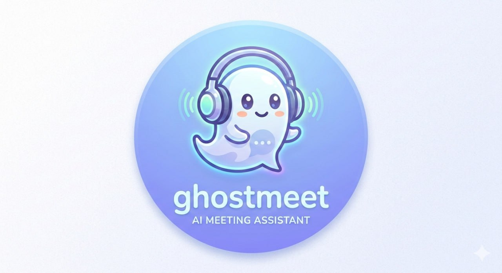
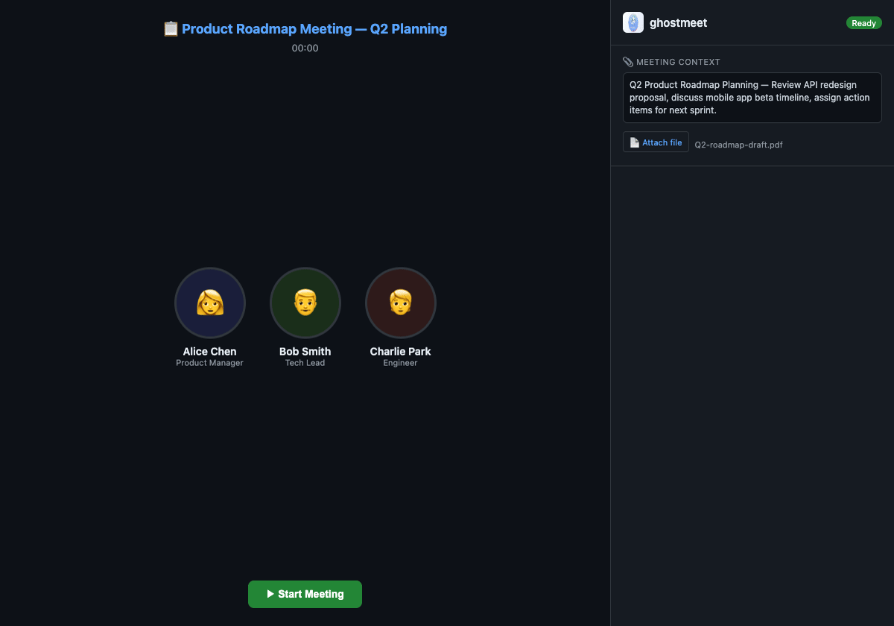

<p align="center">
  
</p>

<h1 align="center">ghostmeet</h1>

<p align="center">
  <strong>Your invisible AI meeting assistant</strong><br>
  Live captions and smart summaries — right in your browser.
</p>

<p align="center">
  <a href="#quick-start">Quick Start</a> •
  <a href="#how-it-works">How It Works</a> •
  <a href="#features">Features</a> •
  <a href="#api">API</a>
</p>

---

<p align="center">
  
</p>

## What is ghostmeet?

ghostmeet silently captures audio from any browser tab — Google Meet, Zoom, Teams, or anything with sound — and transcribes it in real-time using Whisper. When the meeting ends, click **Summarize** and AI extracts key decisions, action items, and next steps.

It runs as a **Chrome Extension side panel**. Other participants can't see it. Like a ghost in your meeting. 👻

- **100% local** — audio never leaves your machine
- **No accounts** — no sign-up, no cloud, no subscriptions
- **Works everywhere** — any tab that plays audio

## Features

- 🎙️ **Real-time transcription** — Whisper STT, updates every 10 seconds
- 📋 **AI-powered summaries** — Key decisions, action items, next steps
- 📎 **Meeting context** — Add agenda or attach files before the meeting
- 🔒 **Self-hosted** — your audio stays on your machine
- 🐳 **One-command setup** — `docker compose up` and you're ready
- 👻 **Invisible** — side panel UI, no one in the meeting knows

## How It Works

```
Browser Tab (Zoom / Meet / Teams)
    │
    ├── Chrome Extension captures tab audio (chrome.tabCapture)
    │
    ▼
WebSocket ──→ Local Backend (FastAPI + Whisper)
                  │
                  ├── Real-time STT ──→ Live Captions (Side Panel)
                  │
                  └── Claude AI (on demand) ──→ Meeting Summary
```

Everything runs on your machine. The only external call is to Claude API when you click Summarize (optional — transcription works without it).

## Quick Start

### Prerequisites

- **Docker** (recommended) or Python 3.10+
- **Chrome** browser

### 1) Start the backend

```bash
git clone https://github.com/Higangssh/ghostmeet.git
cd ghostmeet

# Copy and edit config (add your Anthropic API key for summaries)
cp .env.example .env

# Start with Docker
docker compose up -d
```

Backend is ready when you see `http://0.0.0.0:8877` in the logs.

<details>
<summary><strong>Manual install (without Docker)</strong></summary>

```bash
python3 -m venv .venv && source .venv/bin/activate
pip install -r requirements.txt
python -m backend
```

Note: First run downloads the Whisper model (~150MB for `base`).
</details>

### 2) Install Chrome Extension

1. Open **chrome://extensions** in Chrome
2. Enable **Developer mode** (toggle in top-right)
3. Click **Load unpacked**
4. Select the `extension/` folder from this repo
5. Pin the 👻 icon in your toolbar

### 3) Use it

1. **Join a meeting** — Open Google Meet, Zoom, Teams (or any tab with audio)
2. **Click 👻** — Side panel opens on the right
3. **Click ▶ Start** — Live captions appear as people speak
4. **Click ■ Stop** — When the meeting ends
5. **Click 📋 Summarize** — AI generates a structured summary

That's it. No sign-up, no config, no cloud.

## Configuration

Set these in `.env` or `docker-compose.yml`:

| Variable | Default | Description |
|----------|---------|-------------|
| `GHOSTMEET_MODEL` | `base` | Whisper model size (`tiny` / `base` / `small` / `medium` / `large`) |
| `GHOSTMEET_DEVICE` | `auto` | Compute device (`auto` / `cpu` / `cuda`) |
| `GHOSTMEET_LANGUAGE` | auto-detect | Force language (`en` / `ko` / `ja` / etc.) |
| `GHOSTMEET_CHUNK_INTERVAL` | `10` | Seconds between transcription updates |
| `GHOSTMEET_ANTHROPIC_KEY` | — | Required for AI summaries |
| `GHOSTMEET_HOST` | `0.0.0.0` | Server bind address |
| `GHOSTMEET_PORT` | `8877` | Server port |

**Model size guide:**
- `tiny` — fastest, least accurate (~75MB)
- `base` — good balance (recommended, ~150MB)
- `small` — better accuracy, slower (~500MB)
- `medium` / `large` — best accuracy, needs GPU

## API

| Endpoint | Method | Description |
|----------|--------|-------------|
| `/api/health` | GET | Health check + model info |
| `/api/sessions` | GET | List all sessions |
| `/api/sessions/{id}` | GET | Session details |
| `/api/sessions/{id}/transcript` | GET | Full transcript |
| `/api/sessions/{id}/summarize` | POST | Generate AI summary |
| `/api/sessions/{id}/summary` | GET | Get generated summary |
| `/ws/audio` | WS | Audio ingest (binary) |
| `/ws/transcript/{id}` | WS | Live transcript stream |

## Project Structure

```
ghostmeet/
├── extension/              # Chrome MV3 Extension
│   ├── manifest.json       # permissions + side panel config
│   ├── background.js       # tab audio capture → WebSocket
│   ├── sidepanel.html/js   # live captions UI
│   ├── popup.html/js       # start/stop controls
│   └── icons/              # extension icons
├── backend/                # Python backend (FastAPI)
│   ├── app.py              # HTTP + WebSocket server
│   ├── audio_processor.py  # Whisper transcription pipeline
│   ├── transcriber.py      # faster-whisper wrapper
│   ├── summarizer.py       # Claude API integration
│   └── models.py           # session + segment models
├── assets/                 # logo, demo GIF
├── docker-compose.yml      # one-command deployment
├── Dockerfile              # backend container
└── requirements.txt        # Python dependencies
```

## Roadmap

- [x] Real-time transcription (Whisper)
- [x] Chrome Extension side panel UI
- [x] AI meeting summaries (Claude)
- [x] Meeting context input + file attach
- [ ] Speaker diarization (who said what)
- [ ] Export to Markdown / PDF
- [ ] Multi-language support
- [ ] Agent Mode — AI speaks in the meeting for you

## License

[MIT](LICENSE)
